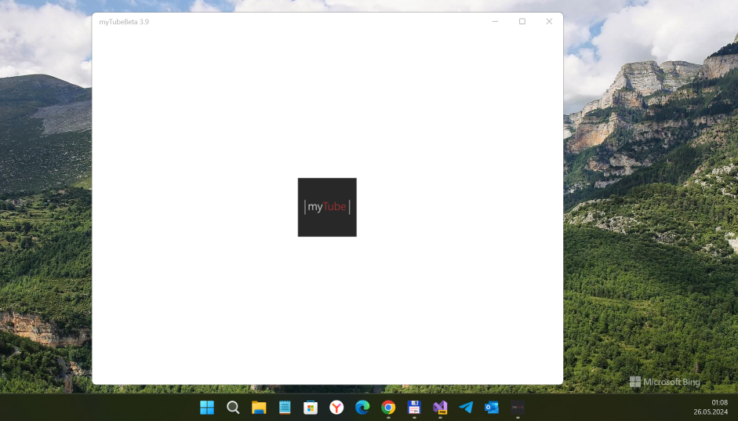

# myTube
Old myTube for WP8.1 R.E.

## Screenshot (the original appx used)

## About the original
MyTube is the (a) famous Toutube UWP client / application that using Youtube API from google. 
Sadly, its W10M developing stopped... and some bugs are critial :( 

## My 2 cents
- Appx Decomp.
- Fast code/architecture research
- WP8 -> W10M code "rebase" ("refactor.") - 5 % only  

## Result
- Draft / Damaged
- Idk how to finish this work... Experienced developer help needed

## Credits / License
- https://github.com/Ryken100 Ryken Studio 
- https://github.com/Ryken100/mytube myTube repo without any src codes
- MIT

## ..
As is. No support. RnD only. DIY

## .
[m][e] 2023
