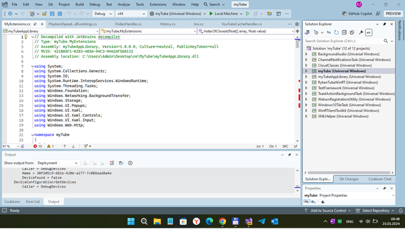

# myTube - myTube 3.9 "remake" (RnD)

## Screenshots

## About the original
MyTube is the the famous Youtube client / application that using Youtube API from google. Sadly, its WP8 / W10M developing stopped by its developers... and thera are some critial bugs such damaged webbrowser google auth. :(

So, myTube reconstruction is very important thing :) 

## My 2 cents
- Appx Decomp.
- Fast code/architecture research
- WP8 -> W10M code "rebase" ("refactor.") - 18 % only  
- App builded with minimal UI yet
- Min. Win. os build temporary set at 16299 (not at 14393) for future debug deals

## Architecture
- myTube
- myTubeAppLibrary
- RykenTubeWinRT
- WinRTXamlToolkit
- XMLHelper
- CloudClasses
- Windows10TileTask (R.E. of some myTube 3.x)
- WatsonRegistrationUtility (R.E. of some myTube 3.x)
- ToastActionBackgroundTask (R.E. of some myTube 3.x)
- ChannelNotificationsTask (R.E. of some myTube 3.x)
- BackgroundAudio (R.E. of some myTube 3.x)
- TestFramework

## Progress
- Draft / Damaged
- Idk how to finish this work... More experienced developer's help needed!

## License / Credits
- MIT  
- https://github.com/Ryken100 Christopher Blackman aka Ryken (Ryken Studio) 
- https://github.com/Ryken100/mytube myTube Wiki, Discord link, etc...

## ..
As is. No support. RnD only. DIY

## .
[m][e] 2024
