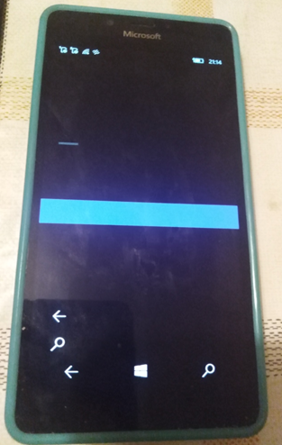

# myTube 3.9.125 -- myTube 2.7.x + 3.9.x "synthez"

## Screenshots

## About the original
MyTube is the the famous Youtube client / application that using Youtube API from google. Sadly, its WP8 / W10M developing stopped by its developers... and thera are some critial bugs such damaged webbrowser google auth. :(

So, myTube reconstruction is very important thing :) 

## My 2 cents
- Appx Decomp.
- Fast code/architecture research
- WP8 -> W10M code rebase/refactoring - approx. 25% 
- App builded with minimal UI yet
- Min. Win. os build - 14393

## Architecture
- myTube (R.E. of some myTube 2.7.x)
- myTubeAppLibrary (R.E. of some myTube 2.7.x)
- RykenTubeWinRT (R.E. of some myTube 2.7.x)
- WinRTXamlToolkit (R.E. of some myTube 2.7.x)
- XMLHelper (R.E. of some myTube 2.7.x)
- CloudClasses (R.E. of some myTube 2.7.x)
- Windows10TileTask (R.E. of some myTube 3.9.x)
- WatsonRegistrationUtility (R.E. of some myTube 3.9.x)
- ToastActionBackgroundTask (R.E. of some myTube 3.9.x)
- ChannelNotificationsTask (R.E. of some myTube 3.9.x)
- BackgroundAudio (R.E. of some myTube 3.9.x)
- TestFramework

## Progress
- Draft / Early bird
- No HomePage, etc. Only partially reconstructed TextPage.. =)
- XAML experimentation, RnD some event handlers, OverCanvas feature, etc...

## License / Credits
- MIT  
- https://github.com/Ryken100 Christopher Blackman aka Ryken (Ryken Studio) 
- https://github.com/Ryken100/mytube myTube Wiki, Discord link, etc...

## ..
As is. No support. RnD only. DIY

## .
[m][e] 2024
